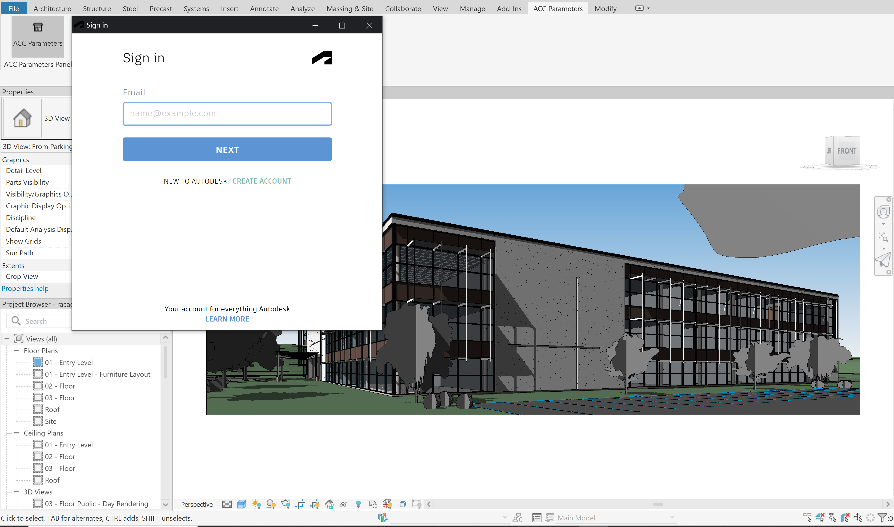
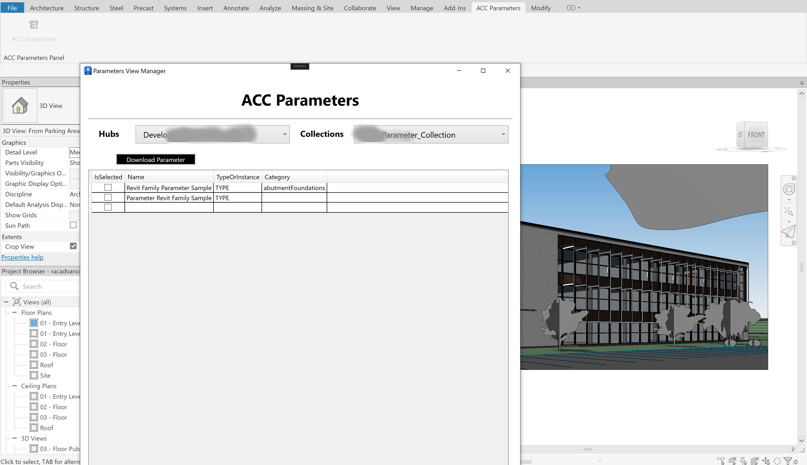

# Revit Parameters API Addin

[Revit](https://www.autodesk.com/products/revit/overview) Addin built to showcase [Parameters API](https://aps.autodesk.com/en/docs/parameters/v1/overview/introduction/)

## Development

### Prerequisites

- [APS credentials](https://forge.autodesk.com/en/docs/oauth/v2/tutorials/create-app)
- [.NET 6](https://dotnet.microsoft.com/en-us/download/dotnet/6.0)
- Terminal (for example, [Windows Command Prompt](https://en.wikipedia.org/wiki/Cmd.exe)
or [macOS Terminal](https://support.apple.com/guide/terminal/welcome/mac))

### Setup & Run

- Clone this repository
- Install dependencies: `dotnet restore`
- Setup environment variables in the appsettings.json File:
  - `ClientId` - your APS application client ID
  - `ClientSecret` - your APS application client secret
- Run the server: `dotnet run`

> Currently the addin uses "http://localhost:3000/api/aps/callback/oauth as the callback and this can be changed to whatever port you wish by adding an environment variable "PORT".

> On the tools bar, you will see the ACC Parameters tab which opens to reveal ACC Parameters button.

> You might need to login to your aps account on the first time

After login you will see your Hubs and Collections side by side

## Troubleshooting

### Access denied

If you get access denied error when running the addin authentication, please run Visual Studio in Administrator mode to get 3 legged authentication working

If you have any other question, please contact us via [APS get help](https://forge.autodesk.com/en/support/get-help).

## Blog

For more information, see the documentation:

- [Parameters API Information](https://aps.autodesk.com/autodesk-parameters-api-cover-page)

## License

This sample is licensed under the terms of the [MIT License](http://opensource.org/licenses/MIT).
Please see the [LICENSE](LICENSE) file for more details.
