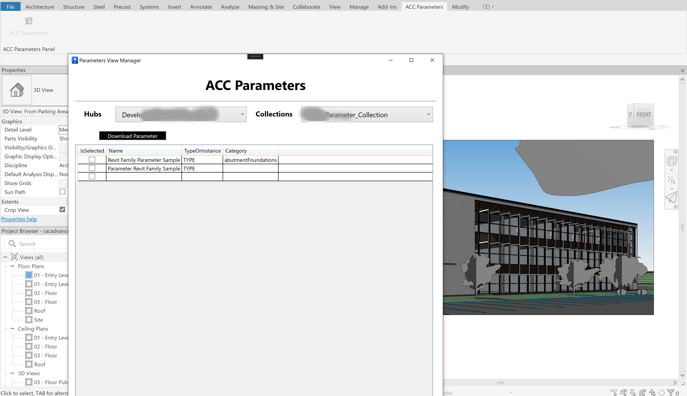
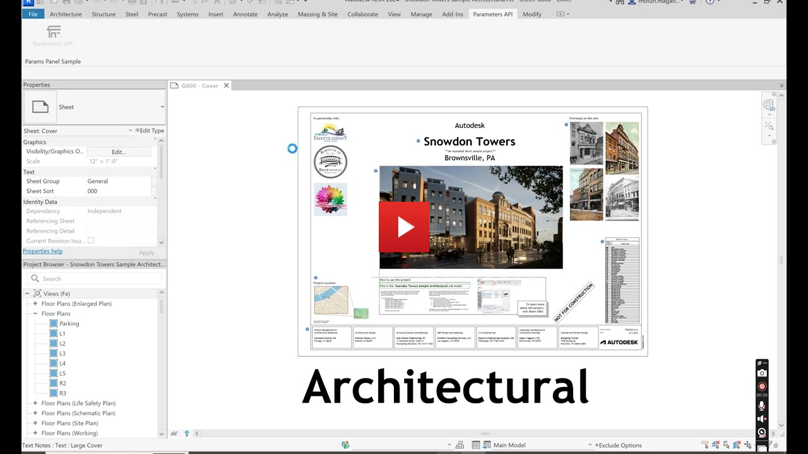

# Revit Parameters Import


[](https://visualstudio.microsoft.com/vs/community/)

[](http://autodesk.com/revit)

[](http://developer.autodesk.com/)
[](https://aps.autodesk.com/en/docs/parameters/v1/overview/introduction/)


[](http://opensource.org/licenses/MIT)


# Description

This sample demonstrates the following features:
- List parameters from ACC Account using [Parameters API](https://aps.autodesk.com/en/docs/parameters/v1/overview/introduction/)
- Add selected parameters from ACC Account to Revit project using [Revit API](https://help.autodesk.com/view/RVT/2025/ENU/?guid=Revit_API_Revit_API_Developers_Guide_Basic_Interaction_with_Revit_Elements_Parameters_Shared_Parameters_html)


# Thumbnail




# Demonstration

- Start Revit, Open a Revit project, goto `ACC Parameters` tab and click `ACC Parameters` button, or goto `Add-Ins` tab > `External Tools` > select the command `Command RevitParametersAddin`, login with your Autodesk credential
- The `Parameters View Mananger` dialog pops up
- Select ACC Hub, select collection, all the Revit compatible parameters will be listed
- Select the parameters, click `download parameter` button
- Goto `Manage` Tab, and click `Project Parameters` button
- The new parameters are added to the project parameters list

For details, please watch the following video:

- [](https://www.youtube.com/watch?v=j6oEB_lrv9w "Revit Addin with Parameters API")

# Setup

## Prerequisites

- [APS credentials](https://forge.autodesk.com/en/docs/oauth/v2/tutorials/create-app)
- [Visual Studio Community 2022](https://visualstudio.microsoft.com/vs/community/) or [.NET 8](https://dotnet.microsoft.com/en-us/download/dotnet/8.0)
- Terminal (for example, [Windows Command Prompt](https://en.wikipedia.org/wiki/Cmd.exe) 
or [macOS Terminal](https://support.apple.com/guide/terminal/welcome/mac)) if you don't have Visual Studio

## Running locally

If you have Visual Studio Community 2022 installed

- Clone this repository
- Build and run the project

If you do not have it installed

- Clone this repository
- Install dependencies: `dotnet restore`
- Setup environment variables in the appsettings.json File:
  - `ClientId` - your APS application client ID
  - `ClientSecret` - your APS application client secret
- Run the project: `dotnet run`

Currently the addin uses `http://localhost:3000/api/aps/callback/oauth` as the callback. This callback should also be added at your application Callback URL in the General Settings section of your [APS Application](https://aps.autodesk.com/myapps/). The port can be changed to whatever port you wish by adding an environment variable "PORT".

Follow the `Demonstration` section above to play with addin.

# Further Reading

## Tips & Tricks

- If you run the application and encounter an exception saying assembly `Autodesk.Forge` cannot be loaded, you can solve this by copying the assembly (together with dependencies) to the roaming folder of your Revit plugin.

- Before running the plugin, we need be able to communicate with 3 legged token callback over HTTP and HTTPS. At a minimum, you want to configure a URL registration and add a Firewall exception for the URL your service will be using. You can configure these settings with the Netsh.exe tool as follows:
```powershell
netsh http add urlacl url=http://+:3000/api/aps/callback/oauth/ user=DOMAIN\user
```
- Please refer to [Configuring HTTP and HTTPS](https://docs.microsoft.com/en-us/dotnet/framework/wcf/feature-details/configuring-http-and-https?redirectedfrom=MSDN) for details.

## Troubleshooting

- Access denied: If you get access denied error when running the addin authentication, please run Visual Studio in Administrator mode to get 3 legged authentication working


## Documentation

For more information, see the documentation:

- [Parameters API Documentation](https://aps.autodesk.com/autodesk-parameters-api-cover-page)
- [Revit API: Shared Parameters](https://help.autodesk.com/view/RVT/2025/ENU/?guid=Revit_API_Revit_API_Developers_Guide_Basic_Interaction_with_Revit_Elements_Parameters_Shared_Parameters_html)

# License

This sample is licensed under the terms of the [MIT License](http://opensource.org/licenses/MIT). Please see the [LICENSE](LICENSE) file for full details.

# Written by

[Moturi Magati George](https://www.linkedin.com/in/moturigeorge/), [Autodesk Partner Development](http://aps.autodesk.com)
