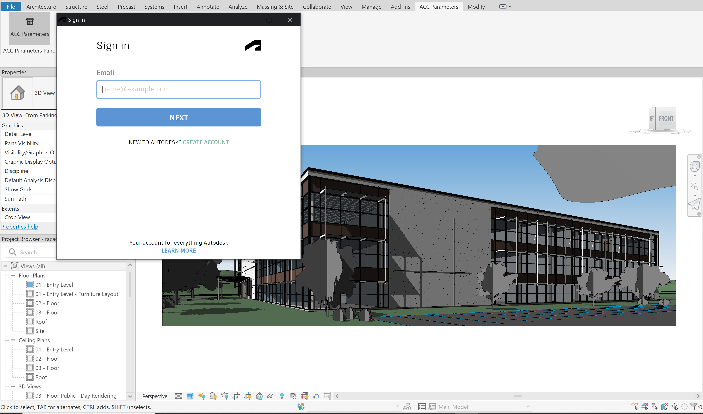

# Revit Addin with Parameters API


[](https://visualstudio.microsoft.com/vs/community/)

[](http://developer.autodesk.com/)
[](https://aps.autodesk.com/en/docs/parameters/v1/overview/introduction/)


[](http://autodesk.com/revit)


[](http://opensource.org/licenses/MIT)


## Description

This sample demonstrates displaying and adding parameters from the [Parameters API](https://aps.autodesk.com/en/docs/parameters/v1/overview/introduction/) service using [Revit](https://www.autodesk.com/products/revit/overview) application to the Revit document. 

To achieve this, you need to login into your APS account to get a token. After getting the token you will use it to get your available hubs. This will now enable you to get a list on collections from your active hub. 

After selecting the active hubs and collection, you will now get the parameters.

This project will add the parameters from the Parameters API into Revit project parameters.


## Thumbnail




## Demonstration

[](https://www.youtube.com/watch?v=j6oEB_lrv9w "Revit Addin with Parameters API")

## Setup

### Prerequisites

- [APS credentials](https://forge.autodesk.com/en/docs/oauth/v2/tutorials/create-app)
- [Visual Studio Community 2022](https://visualstudio.microsoft.com/vs/community/) or [.NET 6](https://dotnet.microsoft.com/en-us/download/dotnet/6.0)
- Terminal (for example, [Windows Command Prompt](https://en.wikipedia.org/wiki/Cmd.exe) 
or [macOS Terminal](https://support.apple.com/guide/terminal/welcome/mac)) if you don't have Visual Studio.

### Running locally
If you have Visual Studio Community 2022 installed
- Clone this repository
- Build and run the project

If you do not have it installed
- Clone this repository
- Install dependencies: `dotnet restore`
- Setup environment variables in the appsettings.json File:
  - `ClientId` - your APS application client ID
  - `ClientSecret` - your APS application client secret
- Run the project: `dotnet run`

Currently the addin uses `http://localhost:3000/api/aps/callback/oauth` as the callback. This callback should also be added at your application Callback URL in the General Settings section of your [APS Application](https://aps.autodesk.com/myapps/)). The port can be changed to whatever port you wish by adding an environment variable "PORT".

On the tools bar, you will see the ACC Parameters tab which opens to reveal ACC Parameters button.

You might need to login to your aps account on the first time.


## Tips & Tricks
- If you run the application, and meet the exception of assembly `Autodesk.Forge` cannot be loaded, you can solve this by copying the assembly (together with dependencies) to the roaming folder of your Revit plugin.

- Before running the plugin, since we need to communicate with 3 legged token callback over HTTP and HTTPS. At a minimum, you want to configure a URL registration and add a Firewall exception for the URL your service will be using. You can configure these settings with the Netsh.exe tool as follow. 
```powershell
netsh http add urlacl url=http://+:3000/api/aps/callback/oauth/ user=DOMAIN\user
```
Please refer [Configuring HTTP and HTTPS](https://docs.microsoft.com/en-us/dotnet/framework/wcf/feature-details/configuring-http-and-https?redirectedfrom=MSDN) for details.

## Troubleshooting

### Access denied

If you get access denied error when running the addin authentication, please run Visual Studio in Administrator mode to get 3 legged authentication working

If you have any other question, please contact us via [APS get help](https://forge.autodesk.com/en/support/get-help).

## Blog

For more information, see the documentation:

- [Parameters API Information](https://aps.autodesk.com/autodesk-parameters-api-cover-page)

## License

This sample is licensed under the terms of the [MIT License](http://opensource.org/licenses/MIT). Please see the [LICENSE](LICENSE) file for full details.

## Written by
[Moturi Magati George](https://www.linkedin.com/in/moturigeorge/), [Autodesk Partner Development](http://aps.autodesk.com)
